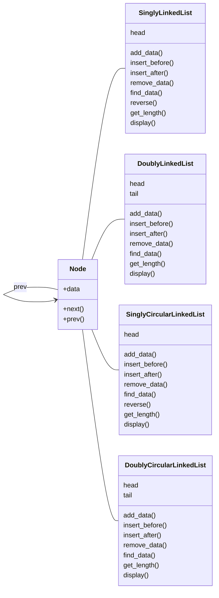

# 2024春数算机考笔记

## 一、python语法

### 1. 欧拉筛

#### ①输出列表的

```python
def euler_sieve(n):
    is_prime, primes = [True] * (n + 1), []
    for i in range(2, n + 1):
        if is_prime[i]: primes.append(i); (for j in range(i * i, n + 1, i): is_prime[j] = False)            
    return primes
```

#### ②输出真值表的

```python
def euler_sieve(n):
    is_prime = [False, False] + [True] * (n - 1)
    for i in range(2, n + 1):
        if is_prime[i]: (for j in range(i * i, n + 1, i): is_prime[j] = False)     
    return is_prime
```

### 2. OOP

```python
class 'name of the class of certain objects':
    def __init__(self, 'attributes of the object, ...'): self.'notation' = 'attribute'
    def 'function 1'(self):
        ...
        return 'result'
    ...#when using functions in class, use the code"name.func()"
```

### 3. python特有的

#### ①dic

```python
dic = {'a':1, 'b':2, 'c':3}
print(dic.keys())
print(dic.values())
print(dic.items())
#输出
#dict_keys(['a', 'b', 'c'])
#dict_values([1, 2, 3])
#dict_items([('a', 1), ('b', 2), ('c', 3)])
```

#### ②deque

```python
from collections import deque
# 创建一个双端队列
d = deque([1, 2, 3, 4, 5])
# 向右循环移动 2 个位置
d.rotate(2)
print(d)  # 输出: deque([4, 5, 1, 2, 3])
# 向左循环移动 3 个位置
d.rotate(-3)
print(d)  # 输出: deque([2, 3, 4, 5, 1])
```

### 4. 其他

`return`在函数内跳出，`break`跳出循环，`continue`跳出这次循环，继续。

`while`在满足条件后继续，和用于可迭代对象的`for`各有千秋。

`while/for ... else ...`多重判断，不好理解所以尽量别写。

可迭代对象的索引，正数从零开始，倒数从-1开始递减。字符串也是可迭代对象。

`*list`的写法很好用也很好理解，星星符号枚举可迭代对象里面的东西。

`list = sorted(list, key = lambda x: ……………)`对应的lambda函数可以有多个值，排序的时候会依先后顺序排序，就比如高考分数同分的时候先比数学，这是我们比较熟悉的例子，在python里大概可以这么写：`排名 = sorted(排名, key = lambda x: (x.总分, x.数学成绩, …………))`

## 二、数据结构

### 1. 栈stack

```python
class stack:
    def __init__(self): self.items = []#用列表实现类
    def is_empty(self): return self.items == []#判断是否为空
    def push(self, item): self.items.append(item)#添加数据
    def pop(self): return self.items.pop()#弹出数据
    def peek(self): return self.items[len(self.items)-1]#查看数据
    def size(self): return len(self.items)#栈长度
```

### 2. 队列queue

```python
class queue:
    def __init__(self): self.items = []#用列表实现类
    def is_empty(self): return self.items == []#判断是否为空
    def enqueue(self, item): self.items.insert(0, item)#添加数据
    def dequeue(self): return self.items.pop()#弹出数据
    def size(self): return len(self.items)#队列长度
```

### 3. 双端队列deque

```python
class deque:
    def __init__(self): self.items = []#用列表实现类
    def is_empty(self): return self.items == []#判断是否为空
    def addFront(self, item): self.items.append(item)#添加数据
    def addRear(self, item): self.items.insert(0, item)#添加数据
    def removeFront(self): return self.items.pop()#弹出数据
    def removeRear(self): return self.items.pop(0)#弹出数据
    def size(self): return len(self.items)#双端队列长度
```

### 4. 链表linked_list

让GPT写的，prompt如下：

> 写四段代码，用oop的方式，分别是单向、双向、单环、双环链表。要求：每个类都要有==添加==数据、在某个数据==前插入==数据、在某个数据==后插入==数据、==删除==数据、==查找==数据的函数。每个链表都要有==首==，双向链表要求有==尾==。单向链表要求有==reverse==函数，将链表改为反向的链表。都要有输出链表==长度==的函数。所有的数据类型都要有==display==函数，打印出所有链节中的数据。

#### 单向链表SinglyLinkedList

```python
class Node:
    def __init__(self, data=None):
        self.data = data
        self.next = None
class SinglyLinkedList:
    def __init__(self):
        self.head = None
    def reverse(self):
        previous = None
        current = self.head
        while current:
            next_node = current.next
            current.next = previous
            previous = current
            current = next_node
        self.head = previous
```

#### 双向循环链表DoubleCircularLinkedList

```python
class Node:
    def __init__(self, data=None):
        self.data = data
        self.next = None
        self.prev = None
class DoublyCircularLinkedList:
    def __init__(self):
        self.head = None
        self.tail = None
    def add_data(self, data):
        new_node = Node(data)
        if not self.head:
            self.head = new_node
            self.tail = new_node
            self.head.next = self.head
            self.head.prev = self.head
        else:
            new_node.prev = self.tail
            self.tail.next = new_node
            new_node.next = self.head
            self.head.prev = new_node
            self.tail = new_node
    def insert_before(self, existing_data, new_data):
        new_node = Node(new_data)
        if not self.head: return False
        current = self.head
        while current != self.tail.next:
            if current.data == existing_data:
                new_node.next = current
                new_node.prev = current.prev
                current.prev.next = new_node
                current.prev = new_node
                if current == self.head: self.head = new_node
                return True
            current = current.next
        return False
    def insert_after(self, existing_data, new_data):
        new_node = Node(new_data)
        if not self.head: return False
        current = self.head
        while current != self.tail.next:
            if current.data == existing_data:
                new_node.next = current.next
                new_node.prev = current
                current.next.prev = new_node
                current.next = new_node
                if current == self.tail: self.tail = new_node
                return True
            current = current.next
        return False
    def remove_data(self, data):
        if not self.head: return False
        current = self.head
        while current != self.tail.next:
            if current.data == data:
                if current == self.head:
                    self.head = current.next
                    self.head.prev = self.tail
                    self.tail.next = self.head
                elif current == self.tail:
                    self.tail = current.prev
                    self.tail.next = self.head
                    self.head.prev = self.tail
                else:
                    current.prev.next = current.next
                    current.next.prev = current.prev
                return True
            current = current.next
        return False
    def find_data(self, data):
        if not self.head: return False
        current = self.head
        while current != self.tail.next:
            if current.data == data: return True
            current = current.next
        return False
    def get_length(self):
        if not self.head: return 0
        count = 0
        current = self.head
        while current != self.tail: count += 1; current = current.next
        return count + 1
    def display(self):
        if not self.head: return
        current = self.head
        while current != self.tail.next: print(current.data); current = current.next
```



### 5. 树tree

#### 多叉树

```python
class node():
    def __init__(self, name):
        self.name = name
        self.children = []
        
    def depth(self):
        if not self: return 0
        elif not (self.left or self.right): return 0
        else: return max(bnode.depth(self.left), bnode.depth(self.right)) + 1
    def leaf(self):
        if not self: return 0
        elif not (self.left or self.right): return 1
        else: return bnode.leaf(self.left) + bnode.right(self.right)
        
    def depth(self):
        if not children: return 0
        else: return max(node.depth(child) for child in self.children) + 1
    def leaf(self):
        if not children: return 1
        else: return sum(node.leaf(child) for child in self.children)
        
    def bfs(self):
        source, answer = [self], []
    	while source: node = source.pop(0); answer += node.name,; source += node.children
    	return answer
    def dfs(self):
        source, answer = [self], []
    	while source: node = source.pop(); answer += node.name,; source += node.children[::-1]
        return answer
```

#### 二叉树binaryTree

```python
class binaryTree:
	def __init__(self, root):
        self.key = root
        self.left = None
        self.right = None
        
    def insertleft(self, new_node):
        if self.left = None: self.left = binaryTree(new_node)
        else: curr = binaryTree(new_node); curr.left = self.left; self.left = curr
    def insertright(self, new_node):
        if self.right = None: self.right = binaryTree(new_node)
        else: curr = binaryTree(new_node); curr.right = self.right; self.right = curr
            
    def get_left(self): return self.left
    def get_right(self): return self.right
    
    def set_root(self, data): self.key = data
    def get_root(self): return self.key
    
    def bfs(self):
        source, answer = [self], []
    	while source: node = source.pop(0); answer += node.name,
     	    if node.left: source += node.left,
      	    if node.right: source += node.right,
    	return answer
    def dfs(self):
        source, answer = [self], []
    	while source: node = source.pop(); answer += node.name
            if node.right: source += node.right,
            if node.left: source += node.left,
        return answer
    
    def pre_order(self):
        if not self: return []
        return self.name + bnode.pre_order(self.left) + bnode.pre_order(self.right)
    def in_order(self):
        if not self: return []
        return bnode.in_order(self.left) + self.name + bnode.in_order(self.right)
    def post_order(self):
        if not self: return []
        return bnode.post_order(self.left) + bnode.post_order(self.right) + self.name
```

##### 二叉树特殊算法——根据前中建树、中后建树

```python
class Node():
    def __init__(self, name):
        self.name = name
        self.left = []
        self.right = []
  
def build_tree_prein(pre_order, in_order):
    if not pre_order or not in_order: return None
    
    valu = pre_order[0]
    root, divi = Node(valu), in_order.index(valu)
    
    pre_left, pre_right = pre_order[1:divi+1], pre_order[divi+1:]
    in_left,in_right = in_order[:divi], in_order[divi+1:]
    root.left, root.right = build_tree_prein(pre_left, in_left), build_tree_prein(pre_right, in_right)
    
    return root

def build_tree_inpost(in_order, post_order):
    if not in_order or not post_order: return None
    
    valu = post_order[-1]
    root, divi = Node(valu), in_order.index(valu)
    
    in_left,in_right = in_order[:divi], in_order[divi+1:]
    post_left, post_right = post_order[:divi], post_order[divi:-1]
    root.left, root.right = build_tree_inpost(in_left, post_left), build_tree_inpost(in_right, post_right)
    
    return root
```

#### 多叉树<->二叉树

```python
class B_node:
    def __init__(self, value):
        self.value = value
        self.left = None
        self.right = None
        
class T_node:
    def __init__(self, value):
        self.value = value
        self.children = []
        
def to_b_tree(t_node):
    if t_node is None: return None
    b_node = B_node(t_node.value)
    if len(t_node.children) > 0: b_node.left = to_b_tree(t_node.children[0])
    current_node = b_node.left
    for child in t_node.children[1:]: current_node.right = to_b_tree(child); current_node = current_node.right
    return b_node

def to_tree(b_node):
    if b_node is None: return None
    t_node, child = T_node(b_node.value), b_node.left
    while child is not None: t_node.children += to_tree(child); child = child.right
    return t_node
```

#### 并查集disjointSet

```python
class DisjSet:
    def __init__(self, n):
        self.rank = [1] * n
        self.parent = [i for i in range(n)]

    def find(self, x):
        if (self.parent[x] != x): self.parent[x] = self.find(self.parent[x])
        return self.parent[x]

    def Union(self, x, y):
        xset, yset = self.find(x), self.find(y)
        if xset == yset: return

        if self.rank[xset] < self.rank[yset]: self.parent[xset] = yset
        elif self.rank[xset] > self.rank[yset]: self.parent[yset] = xset
        else: self.parent[yset] = xset; self.rank[xset] = self.rank[xset] + 1
```

### 6. 图graph

内附dfs、bfs、dijkstra、prim、kurstal

```python
from collections import deque
import heapq
class Vertex:
    def __init__(self, key):
        self.key = key
        self.connectedTo = {}
        self.color = "white"  # 顶点的颜色
        self.distance = float('inf')  # 顶点到起始顶点的距离，默认为无穷大
        self.previous = None  # 顶点在遍历中的前驱顶点
        self.disc = 0  # 顶点的发现时间
        self.fin = 0  # 顶点的完成时间
    def addNeighbor(self, nbr, weight=0): self.connectedTo[nbr] = weight
    def getNeighbor(self): return self.connectedTo.keys()
class Graph:
    def __init__(self):
        self.vertices = {}
        self.numVertices = 0
        self.numEdges = 0
    def add_vertex(self, key):
        self.numVertices += 1
        new_vertex = Vertex(key)
        self.vertices[key] = new_vertex
        return new_vertex
    def get_vertex(self, key): return self.vertices.get(key)
    def __len__(self): return self.numVertices
    def __contains__(self, key): return key in self.vertices
    def add_edge(self, f, t, weight=0):
        if f not in self.vertices: self.add_vertex(f)
        if t not in self.vertices: self.add_vertex(t)
        self.vertices[f].addNeighbor(self.vertices[t], weight)
        self.numEdges += 1
    def get_vertices(self): return self.vertices.keys()
    def __iter__(self): return iter(self.vertices.values())
    
    def dfs(self, start_vertex):
        start_vertex.color = "gray"
        for neighbor in start_vertex.getNeighbor(): 
            if neighbor.color == "white": self.dfs(neighbor)
        start_vertex.color = "black"
	def bfs(self, start_vertex):
        queue = deque()
        start_vertex.color = "gray"
        queue.append(start_vertex)
        while queue:
            current_vertex = queue.popleft()
            for neighbor in current_vertex.getNeighbor():
                if neighbor.color == "white": neighbor.color = "gray"; queue.append(neighbor)
            current_vertex.color = "black"
            
    def dijkstra(self, start_vertex):
        # 初始化距离和前驱顶点
        for vertex in self: vertex.distance = float('inf'); vertex.previous = None
        start_vertex.distance = 0
        priority_queue = [(0, start_vertex)]
        while priority_queue:
            current_distance, current_vertex = heapq.heappop(priority_queue)
            if current_distance > current_vertex.distance: continue
            for neighbor in current_vertex.getNeighbor():
                weight = current_vertex.connectedTo[neighbor]
                distance = current_vertex.distance + weight
                if distance < neighbor.distance: neighbor.distance = distance; neighbor.previous = current_vertex; heapq.heappush(priority_queue, (distance, neighbor))
                    
    def prim(self, start_vertex):
        # 初始化顶点的距离和前驱顶点
        for vertex in self: vertex.distance = float('inf'); vertex.previous = None

        start_vertex.distance = 0
        priority_queue = [(0, start_vertex)]
        visited = set()

        while priority_queue:
            current_distance, current_vertex = heapq.heappop(priority_queue)
            if current_vertex in visited: continue
            visited.add(current_vertex)
            for neighbor in current_vertex.getNeighbor():
                weight = current_vertex.connectedTo[neighbor]
                if neighbor not in visited and weight < neighbor.distance: neighbor.distance = weight; neighbor.previous = current_vertex; heapq.heappush(priority_queue, (weight, neighbor))

    def kruskal(self):
        parent, rank = {}, {}
        for vertex in self: parent[vertex] = vertex; rank[vertex] = 0
        edges = []
        for vertex in self:
            for neighbor in vertex.getNeighbor(): weight = vertex.connectedTo[neighbor]; edges.append((weight, vertex, neighbor))
        edges.sort()
        minimum_spanning_tree = Graph()
        for edge in edges:
            weight, vertex1, vertex2 = edge
            if self.find(parent, vertex1) != self.find(parent, vertex2): minimum_spanning_tree.add_edge(vertex1.key, vertex2.key, weight); self.union(parent, rank, vertex1, vertex2)
        return minimum_spanning_tree

    def find(self, parent, vertex):
        if parent[vertex] != vertex: parent[vertex] = self.find(parent, parent[vertex])
        return parent[vertex]
    def union(self, parent, rank, vertex1, vertex2):
        root1, root2 = self.find(parent, vertex1); self.find(parent, vertex2)

        if rank[root1] < rank[root2]: parent[root1] = root2
        elif rank[root1] > rank[root2]: parent[root2] = root1
        else: parent[root2] = root1;rank[root1] += 1
```

#### 有向图的拓扑排序

```python
class DirectedGraph:
    def __init__(self):
        self.vertices = {}

    def add_vertex(self, vertex):
        self.vertices[vertex] = {"in_degree": 0, "out_degree": 0}

    def add_edge(self, start_vertex, end_vertex):
        if start_vertex in self.vertices and end_vertex in self.vertices:
            self.vertices[start_vertex]["out_degree"] += 1
            self.vertices[end_vertex]["in_degree"] += 1

    def remove_edge(self, start_vertex, end_vertex):
        if start_vertex in self.vertices and end_vertex in self.vertices:
            self.vertices[start_vertex]["out_degree"] -= 1
            self.vertices[end_vertex]["in_degree"] -= 1

    def get_adjacent_vertices(self, vertex):
        if vertex in self.vertices:
            adjacent_vertices = []
            for v in self.vertices:
                if self.has_edge(vertex, v):
                    adjacent_vertices.append(v)
            return adjacent_vertices

    def has_edge(self, start_vertex, end_vertex):
        if start_vertex in self.vertices and end_vertex in self.vertices:
            return self.vertices[start_vertex]["out_degree"] > 0 and self.vertices[end_vertex]["in_degree"] > 0

    def topological_sort(self):
        in_degree_map = {v: self.vertices[v]["in_degree"] for v in self.vertices}
        queue = [v for v, in_degree in in_degree_map.items() if in_degree == 0]
        result = []

        while queue:
            vertex = queue.pop(0)
            result.append(vertex)

            for adjacent_vertex in self.get_adjacent_vertices(vertex):
                in_degree_map[adjacent_vertex] -= 1
                if in_degree_map[adjacent_vertex] == 0:
                    queue.append(adjacent_vertex)

        if len(result) != len(self.vertices):
            # 图中存在环路，无法进行拓扑排序
            return []

        return result
```

## 三、算法

### 1. 排序

#### 归并排序

```python
def merge_count(arr, l, r):
    if l >= r:
        return 0
    
    mid = (l + r) // 2
    count = merge_count(arr, l, mid) + merge_count(arr, mid + 1, r)
    
    temp = []
    i, j = l, mid + 1
    while i <= mid and j <= r:
        if arr[i] <= arr [j]: temp.append(arr[i]); i += 1
        else: temp.append(arr[j]); j += 1; count += (mid - i + 1)                
    while i <= mid: temp.append(arr[i]); i += 1
    while j <= r: temp.append(arr[j]); j += 1
    for i in range(len(temp)): arr[l + i] = temp[i]
        
    return count
```

### 2. 单调栈、单调队列

#### 单调栈

```python
def find_left_greater(nums):
    stack = []
    result = [-1] * len(nums)
    for i in range(len(nums)):
        while stack and nums[stack[-1]] < nums[i]: result[stack.pop()] = nums[i]
        stack.append(i)
    return result

# 使用示例
nums = [2, 1, 4, 3, 5]
print(find_left_greater(nums))  # 输出: [-1, -1, 2, 2, 4]
```

#### 单调队列

```python
from collections import deque

def max_in_window(nums, k):
    queue = deque()
    result = []
    for i in range(len(nums)):
        # 将队列中比当前元素小的都弹出
        while queue and nums[queue[-1]] < nums[i]: queue.pop()
        queue.append(i)
        # 如果窗口左边界已经不在队列中了,则将其从队列中移除
        if queue[0] == i - k: queue.popleft()
        # 如果窗口大小达到k,则将队列头部元素(即窗口内最大值)加入结果
        if i >= k - 1: result.append(nums[queue[0]])
    return result

# 使用示例
nums = [1, 3, -1, -3, 5, 3, 6, 7]
print(max_in_window(nums, 3))  # 输出: [3, 3, 5, 5, 6, 7]
```

《荀子·儒效》：“……与时迁徙，与世偃仰，千举万变，其道一也……”