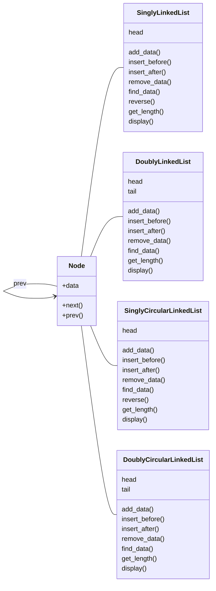

# Assignment #8: 图论：概念、遍历，及 树算

Updated 1150 GMT+8 Apr 8, 2024

2024 spring, Complied by ==罗景轩，地空==


**说明：**

1）请把每个题目解题思路（可选），源码Python, 或者C++（已经在Codeforces/Openjudge上AC），截图（包含Accepted），填写到下面作业模版中（推荐使用 typora https://typoraio.cn ，或者用word）。AC 或者没有AC，都请标上每个题目大致花费时间。

2）提交时候先提交pdf文件，再把md或者doc文件上传到右侧“作业评论”。Canvas需要有同学清晰头像、提交文件有pdf、"作业评论"区有上传的md或者doc附件。

3）如果不能在截止前提交作业，请写明原因。


**编程环境**

操作系统：Windows 11 家庭中文版 22H2 22621.2283 

Python编程环境：Spyder IDE 5.2.2, PyCharm 2023.1.4 (Professional Edition)


## 1. 题目

### 19943: 图的拉普拉斯矩阵

matrices, http://cs101.openjudge.cn/practice/19943/


思路：

把以前的代码拿来AC了

代码

```python
#罗景轩2300012610
n, m = map(int, input().split())
matrix = [[0] * n for _ in range(n)]

for _ in range(m):
    a, b = map(int, input().split())
    matrix[a][a] += 1
    matrix[b][b] += 1
    matrix[a][b] -= 1
    matrix[b][a] -= 1
    
for i in matrix:
    print(*i)

```


代码运行截图 ==（至少包含有"Accepted"）==


### 18160: 最大连通域面积

matrix/dfs similar, http://cs101.openjudge.cn/practice/18160


思路：

把上学期的代码拿来AC了

代码

```python
#罗景轩2300012610
count = 0
def dfs(x, y):
    if M[x + 1][y + 1] == "W":
        global count
        count += 1
        M[x + 1][y + 1] = "."
        for i in range(8):
            dfs(x+d[i][0],y+d[i][1])

T = int(input())
d = [[-1, -1], [-1, 0], [-1, 1],\
     [0, -1], [0, 1],\
     [1, -1], [1, 0], [1, 1]]
    
for i in range(T):
    n, m = map(int, input().split())
    M = [["." for _ in range(m + 2)] for _ in range(n + 2)]
    for i in range(n):
        string = input()
        for j in range(m):
            M[i + 1][j + 1] = string[j]
            
    ans = 0
    for i in range(n):
        for j in range(m):
            if M[i + 1][j + 1] == "W":
                dfs(i, j)
                ans = max(ans, count)
            count = 0
    print(ans)
```


代码运行截图 ==（至少包含有"Accepted"）==


### sy383: 最大权值连通块

https://sunnywhy.com/sfbj/10/3/383


思路：

复用了之前的dfs代码，新加了visit属性

代码

```python
#2300012610ljx
class Node():
    def __init__(self, value, weight, visit):
        self.value = value
        self.weight = weight
        self.children = []
        self.visit = visit
        
def dfs(node):
    source = [node]
    answer = 0
    while source:
        subject = source.pop()
        if not subject.visit:
            subject.visit = True
            answer += subject.weight
            source += subject.children[::-1]
    return answer

n, m = map(int, input().split())
node_list = [Node(i, 0, False) for i in range(n)]
weight_list = list(map(int, input().split()))

for i in range(n):
    node_list[i].weight = weight_list[i]

for _ in range(m):
    a, b = map(int, input().split())
    node_list[a].children += node_list[b],
    node_list[b].children += node_list[a],

max_mass = 0
for node in node_list:
    if not node.visit:
        max_mass = max(max_mass, dfs(node))

print(max_mass)


```


代码运行截图 ==（AC代码截图，至少包含有"Accepted"）==


### 03441: 4 Values whose Sum is 0

data structure/binary search, http://cs101.openjudge.cn/practice/03441


思路：

2+2超内存，后来把defaultdict改成Counter就过了。

代码

```python
#2300012610ljx
from collections import Counter
from itertools import product

A, B, C, D = [], [], [], []

for i in range(int(input())):
    a, b, c, d = map(int, input().split())
    A.append(a)
    B.append(b)
    C.append(c)
    D.append(d)

ab_sum_counter = Counter(map(sum, product(A, B)))
cn = 0
for cd_sum in map(sum, product(C, D)):
    cn += ab_sum_counter.get(-cd_sum, 0)
    
print(cn)

```


代码运行截图 ==（AC代码截图，至少包含有"Accepted"）==


### 04089: 电话号码

trie, http://cs101.openjudge.cn/practice/04089/


思路：

字典树

代码

```python
#2300012610ljx
class TrieNode:
    def __init__(self):
        self.child = {}
        
class Trie:
    def __init__(self):
        self.root = TrieNode()

    def insert(self, nums):
        current = self.root
        for x in nums:
            if x not in current.child:
                current.child[x] = TrieNode()
            current = current.child[x]
            
    def search(self, num):
        current = self.root
        for x in num:
            if x not in current.child:
                return 0
            current = current.child[x]
        return 1
    
for _ in range(int(input())):
    nums = []
    for _ in range(int(input())):
        nums.append(str(input()))
    nums.sort(reverse = True)
    s = 0
    trie = Trie()
    for num in nums:
        s += trie.search(num)
        trie.insert(num)
    if s > 0:
        print('NO')
    else:
        print('YES')

```


代码运行截图 ==（AC代码截图，至少包含有"Accepted"）==


### 04082: 树的镜面映射

http://cs101.openjudge.cn/practice/04082/


思路：

感觉复习了很多之前漏掉的知识，比如把任意树转换为二叉树和倒过来的实现方法。

这个解法的28-34和42-48是完全一致的，但是我还没想到更好的继承办法，期待大佬的简化。

另外感觉这个题解的build_tree和print_tree还是有点太集成了，不好复用。最理想的办法应该是有一个由二叉树生成多叉树的函数，一个层序遍历的函数，这几个函数都不应该局限在这一题上。

代码

```python
#2300012610ljx
from collections import deque

class Node:
    def __init__(self, name):
        self.name = name
        self.children = []
        
def create_node():
    return Node('')

def build_tree(line, index):
    node = create_node()
    fullname = line[index]
    node.name = fullname[0]
    if fullname[1] == '0' and node.name != '$':
        index += 1
        child, index  = build_tree(line, index)
        node.children += child,
        index += 1
        child, index  = build_tree(line, index)
        node.children += child,
    return node, index
        
def print_tree(root):
    queue, stack = deque(), deque()
    
    while root is not None:
        if root.name != '$':
            stack += root,
        root = root.children[1] if len(root.children) > 1 else None
        
    while stack:
        queue.append(stack.pop())
        
    while queue:
        root = queue.popleft()
        print(root.name, end = ' ')
        
        if root.children:
            root = root.children[0]
            while root is not None:
                if root.name != '$':
                    stack += root,
                root = root.children[1] if len(root.children) > 1 else None
            
            while stack:
                queue.append(stack.pop())
    
n = int(input())
line = input().split()

root, _ = build_tree(line, 0)

print_tree(root)
```


代码运行截图 ==（AC代码截图，至少包含有"Accepted"）==


## 2. 学习总结和收获

==如果作业题目简单，有否额外练习题目，比如：OJ“2024spring每日选做”、CF、LeetCode、洛谷等网站题目。==


有了树的基础，图的代码写起来就很快了。基本上只要加几个属性，比如visit之类的。深刻地复用了dfs、bfs的代码。

另外学习了将多叉树和二叉树互相转换的代码。以及字典树。另外想起了在写堆的时候用到了一个`Benjamin`函数，给出指定节点最小的孩子，the Benjamin of the family是一个习语，圣经记载雅各的第十二个孩子，也是最小的孩子，是本杰明，所以有了后世的这个习语。

### 多叉树<->二叉树

```python
class B_node:
    def __init__(self, value):
        self.value = value
        self.left = None
        self.right = None
        
class T_node:
    def __init__(self, value):
        self.value = value
        self.children = []
        
def to_b_tree(t_node):
    if t_node is None:
        return None
    
    b_node = B_node(t_node.value)
    if len(t_node.children) > 0:
        b_node.left = to_b_tree(t_node.children[0])
        
    current_node = b_node.left
    for child in t_node.children[1:]:
        current_node.right = to_b_tree(child)
        current_node = current_node.right
        
    return b_node

def to_tree(b_node):
    if b_node is None:
        return None
    
    t_node = T_node(b_node.value)
    child = b_node.left
    
    while child is not None:
        t_node.children += to_tree(child)
        child = child.right
        
    return t_node
```

使唤GPT写的。

### 图

```python
class Vertex:
    def __init__(self, key):
        self.id = key
        self.connectedTo = {}
        
    def addNeighbor(self, nbr, weight = 0):
        self.connectedTo[nbr] = weight
        
    def __str__(self):
        return str(self.id) + ' connected to: ' + str([nbr.id for nbr in self.connectedTo])
    
    def getConnections(self):
        return self.connectedTo.keys()
    
    def getId(self):
        return self.id
    
    def getWeight(self, nbr):
        return self.connectedTo[nbr]
    
class Graph:
    def __init__(self):
        self.vertList = {}
        self.numVertices = 0
        
    def addVertex(self, key):
        self.numVertices += 1
        newVertex = Vertex(key)
        self.vertList[key] = newVertex
        return newVertex
    
    def getVertex(self, n):
        if n in self.vertList:
            return self.vertList[n]
        else:
            return None
        
    def __len__(self):
        return self.numVertices
    
    def __contains__(self, n):
        return n in self.vertList
    
    def addEdge(self, f, t, weight = 0):
        if f not in self.vertList:
            nv = self.addVertex(f)
        if t not in self.vertList:
            nv = self.addVertex(t)
        self.vertList[f].addNeighbor(self.vertList[t], weight)
        
    def getVertices(self):
        return self.vertList.keys()
    
    def __iter__(self):
        return iter(self.vertList.values())

```

### 各种链表

让GPT写的，prompt如下：

> 写四段代码，用oop的方式，分别是单向、双向、单环、双环链表。要求：每个类都要有==添加==数据、在某个数据==前插入==数据、在某个数据==后插入==数据、==删除==数据、==查找==数据的函数。每个链表都要有==首==，双向链表要求有==尾==。单向链表要求有==reverse==函数，将链表改为反向的链表。都要有输出链表==长度==的函数。所有的数据类型都要有==display==函数，打印出所有链节中的数据。

#### 单向链表

```python
class Node:
    def __init__(self, data=None):
        self.data = data
        self.next = None


class SinglyLinkedList:
    def __init__(self):
        self.head = None

    def add_data(self, data):
        new_node = Node(data)
        if not self.head:
            self.head = new_node
        else:
            current = self.head
            while current.next:
                current = current.next
            current.next = new_node

    def insert_before(self, existing_data, new_data):
        new_node = Node(new_data)
        if not self.head:
            return False

        if self.head.data == existing_data:
            new_node.next = self.head
            self.head = new_node
            return True

        current = self.head
        while current.next:
            if current.next.data == existing_data:
                new_node.next = current.next
                current.next = new_node
                return True
            current = current.next

        return False

    def insert_after(self, existing_data, new_data):
        new_node = Node(new_data)
        current = self.head
        while current:
            if current.data == existing_data:
                new_node.next = current.next
                current.next = new_node
                return True
            current = current.next
        return False

    def remove_data(self, data):
        if not self.head:
            return False

        if self.head.data == data:
            self.head = self.head.next
            return True

        current = self.head
        while current.next:
            if current.next.data == data:
                current.next = current.next.next
                return True
            current = current.next

        return False

    def find_data(self, data):
        current = self.head
        while current:
            if current.data == data:
                return True
            current = current.next
        return False

    def reverse(self):
        previous = None
        current = self.head
        while current:
            next_node = current.next
            current.next = previous
            previous = current
            current = next_node
        self.head = previous

    def get_length(self):
        count = 0
        current = self.head
        while current:
            count += 1
            current = current.next
        return count

    def display(self):
        current = self.head
        while current:
            print(current.data)
            current = current.next

```


#### 双向链表

```python
class Node:
    def __init__(self, data=None):
        self.data = data
        self.next = None
        self.prev = None


class DoublyLinkedList:
    def __init__(self):
        self.head = None
        self.tail = None

    def add_data(self, data):
        new_node = Node(data)
        if not self.head:
            self.head = new_node
            self.tail = new_node
        else:
            new_node.prev = self.tail
            self.tail.next = new_node
            self.tail = new_node

    def insert_before(self, existing_data, new_data):
        new_node = Node(new_data)
        current = self.head
        while current:
            if current.data == existing_data:
                if current.prev:
                    current.prev.next = new_node
                    new_node.prev = current.prev
                else:
                    self.head = new_node
                new_node.next = current
                current.prev = new_node
                return True
            current = current.next
        return False

    def insert_after(self, existing_data, new_data):
        new_node = Node(new_data)
        current = self.head
        while current:
            if current.data == existing_data:
                if current.next:
                    current.next.prev = new_node
                    new_node.next = current.next
                else:
                    self.tail = new_node
                new_node.prev = current
                current.next = new_node
                return True
            current = current.next
        return False

    def remove_data(self, data):
        if not self.head:
            return False

        if self.head.data == data:
            if self.head.next:
                self.head.next.prev = None
            else:
                self.tail = None
            self.head = self.head.next
            return True

        current = self.head
        while current:
            if current.data == data:
                if current.prev:
                    current.prev.next = current.next
                else:
                    self.head = current.next

                if current.next:
                    current.next.prev = current.prev
                else:
                    self.tail = current.prev

                return True
            current = current.next

        return False

    def find_data(self, data):
        current = self.head
        while current:
            if current.data == data:
                return True
            current = current.next
        return False

    def get_length(self):
        count = 0
        current = self.head
        while current:
            count += 1
            current = current.next
        return count

    def display(self):
        current = self.head
        while current:
            print(current.data)
            current = current.next
```


#### 单向循环链表

```python
class Node:
    def __init__(self, data=None):
        self.data = data
        self.next = None


class SinglyCircularLinkedList:
    def __init__(self):
        self.head = None

    def add_data(self, data):
        new_node = Node(data)
        if not self.head:
            self.head = new_node
            new_node.next = self.head
        else:
            current = self.head
            while current.next != self.head:
                current = current.next
            current.next = new_node
            new_node.next = self.head

    def insert_before(self, existing_data, new_data):
        new_node = Node(new_data)
        if not self.head:
            return False

        if self.head.data == existing_data:
            new_node.next = self.head
            current = self.head
            while current.next != self.head:
                current = current.next
            current.next = new_node
            self.head = new_node
            return True

        current = self.head
        while current.next != self.head:
            if current.next.data == existing_data:
                new_node.next = current.next
                current.next = new_node
                return True
            current = current.next

        return False

    def insert_after(self, existing_data, new_data):
        new_node = Node(new_data)
        current = self.head
        while current.next != self.head:
            if current.data == existing_data:
                new_node.next = current.next
                current.next = new_node
                return True
            current = current.next

        if current.data == existing_data:
            new_node.next = current.next
            current.next = new_node
            return True

        return False

    def remove_data(self, data):
        if not self.head:
            return False

        if self.head.data == data:
            current = self.head
            while current.next != self.head:
                current = current.next
            if self.head.next == self.head:
                self.head = None
            else:
                self.head = self.head.next
                current.next = self.head
            return True

        current = self.head
        while current.next != self.head:
            if current.next.data == data:
                current.next = current.next.next
                return True
            current = current.next

        return False

    def find_data(self, data):
        if not self.head:
            return False

        current = self.head
        while current.next != self.head:
            if current.data == data:
                return True
            current = current.next

        if current.data == data:
            return True

        return False
    
    def reverse(self):
        if not self.head:
            return

        previous = None
        current = self.head
        next_node = self.head.next

        while next_node != self.head:
            current.next = previous
            previous = current
            current = next_node
            next_node = next_node.next

        current.next = previous
        self.head = current

    def get_length(self):
        if not self.head:
            return 0

        count = 1
        current = self.head
        while current.next != self.head:
            count += 1
            current = current.next

        return count

    def display(self):
        if not self.head:
            return

        current = self.head
        while True:
            print(current.data)
            current = current.next
            if current == self.head:
                break
```


#### 双向循环链表

```python
class Node:
    def __init__(self, data=None):
        self.data = data
        self.next = None
        self.prev = None


class DoublyCircularLinkedList:
    def __init__(self):
        self.head = None
        self.tail = None

    def add_data(self, data):
        new_node = Node(data)
        if not self.head:
            self.head = new_node
            self.tail = new_node
            self.head.next = self.head
            self.head.prev = self.head
        else:
            new_node.prev = self.tail
            self.tail.next = new_node
            new_node.next = self.head
            self.head.prev = new_node
            self.tail = new_node

    def insert_before(self, existing_data, new_data):
        new_node = Node(new_data)
        if not self.head:
            return False

        current = self.head
        while current != self.tail.next:
            if current.data == existing_data:
                new_node.next = current
                new_node.prev = current.prev
                current.prev.next = new_node
                current.prev = new_node
                if current == self.head:
                    self.head = new_node
                return True
            current = current.next

        return False

    def insert_after(self, existing_data, new_data):
        new_node = Node(new_data)
        if not self.head:
            return False

        current = self.head
        while current != self.tail.next:
            if current.data == existing_data:
                new_node.next = current.next
                new_node.prev = current
                current.next.prev = new_node
                current.next = new_node
                if current == self.tail:
                    self.tail = new_node
                return True
            current = current.next

        return False

    def remove_data(self, data):
        if not self.head:
            return False

        current = self.head
        while current != self.tail.next:
            if current.data == data:
                if current == self.head:
                    self.head = current.next
                    self.head.prev = self.tail
                    self.tail.next = self.head
                elif current == self.tail:
                    self.tail = current.prev
                    self.tail.next = self.head
                    self.head.prev = self.tail
                else:
                    current.prev.next = current.next
                    current.next.prev = current.prev
                return True
            current = current.next

        return False

    def find_data(self, data):
        if not self.head:
            return False

        current = self.head
        while current != self.tail.next:
            if current.data == data:
                return True
            current = current.next

        return False

    def get_length(self):
        if not self.head:
            return 0

        count = 0
        current = self.head
        while current != self.tail:
            count += 1
            current = current.next

        return count + 1

    def display(self):
        if not self.head:
            return

        current = self.head
        while current != self.tail.next:
            print(current.data)
            current = current.next
```

#### 图解


